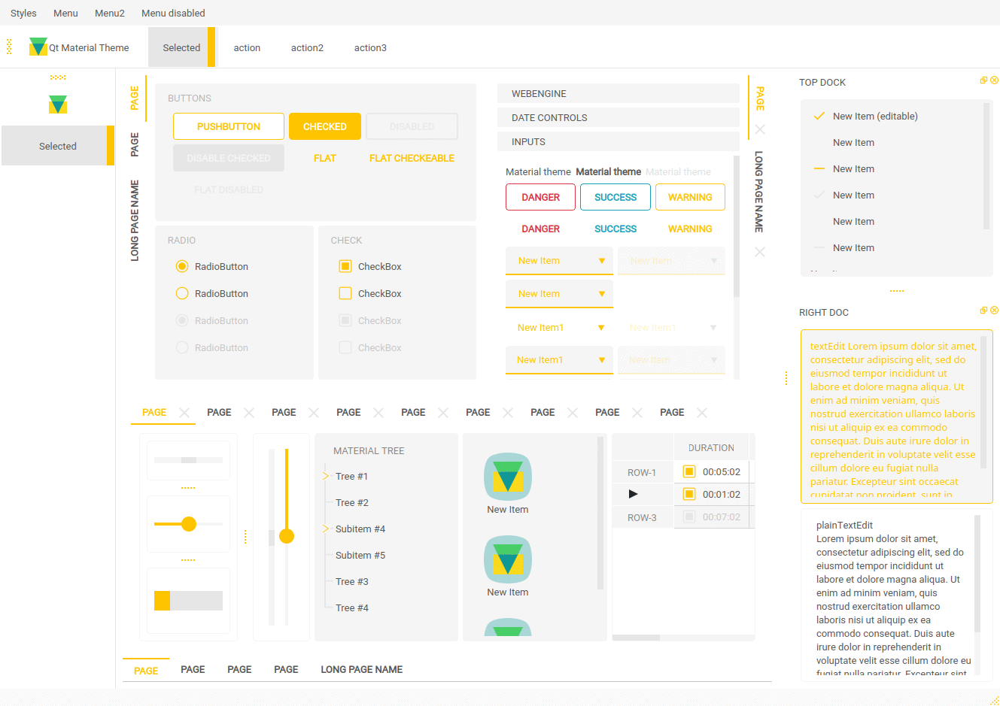
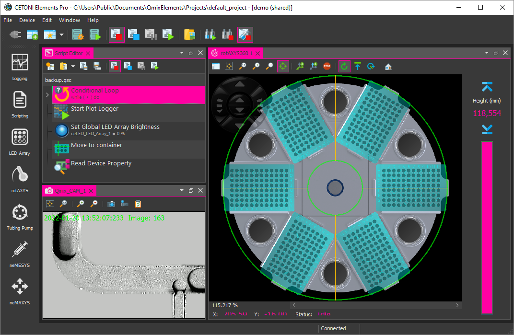
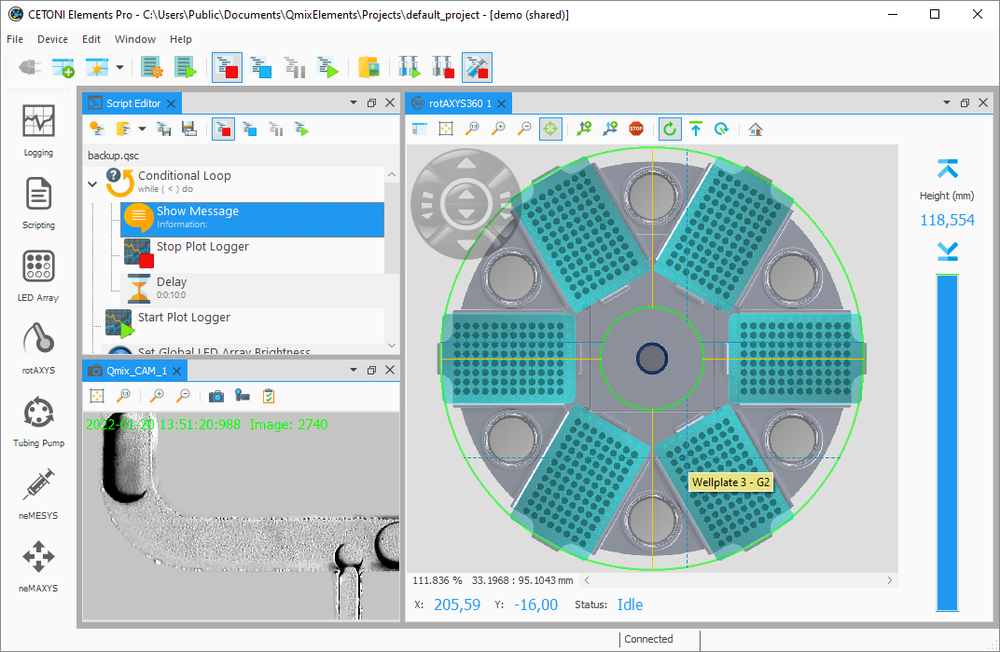

------------------

[](https://github.com/githubuser0xFFFF/Qt-Advanced-Stylesheets/actions?query=workflow%3Alinux-builds)
[](gnu-lgpl-v2.1.md)

Advanced Stylesheets with Theming Support for Qt.

The library allows runtime color switching for stylesheet themes. The libray also
adjusts the colors of the *.svg resources and icons at runtime.
If you run the `full_features` example, then you can test the functionality.

There are some custom dark themes:


And light:



The library allows you to create stylesheets that contain variables that are
replaced at runtime like in this example:

```css
QComboBox:disabled {
  color: {{primaryColor|opacity(0.2)}};
  background-color: {{secondaryColor|opacity(0.75)}};
  border-bottom: 2px solid {{primaryColor|opacity(0.2)}};
}

QComboBox::drop-down {
  border: none;
  color: {{primaryColor}};
  width: 20px;
}
```

## Navigation

- [Navigation](#navigation)
- [Features](#features)
  - [Theme-aware Icons](#theme-aware-icons)
- [Build](#build)
- [Getting started](#getting-started)
- [Run examples](#run-examples)
- [Usage in QML](#usage-in-qml)
- [Future Plans](#future-plans)
- [License information](#license-information)
- [Credits](#credits)
- [Donation](#donation)
- [Showcase](#showcase)
  - [CETONI Elements](#cetoni-elements)

## Features

### Theme-aware Icons

The library supports loading of theme-aware SVG icons.

```cpp
AdvancedStylesheet.loadThemeAwareSvgIcon(":/app/images/progress.svg");
```

This allows runtime color switching of application icons like in the
toolbar below.


## Build

Open the `acss.pro` file with QtCreator and start the build, that's it.
You can run the example projects and test it yourself.

## Getting started

Have look into the file `CMainWindow` in the full_features example to learn
ho to use the `CStyleManager`. Here are the basic steps to add the style
manager to your application:

```cpp
QString AppDir = qApp->applicationDirPath();
QtAdvancedStylesheet AdvancedStylesheet;

// first set the directory that contains all your styles
AdvancedStylesheet.setStylesDirPath(AppDir + "/../../styles");

// now set the output folder where the processed styles are stored. The
// style manager will create a sub directory for each style
AdvancedStylesheet.setOutputDirPath(AppDir + "/output");

// set the current style and select a theme. After these two calls, the output
// folder will contains the generated resoruces and stylesheet.
AdvancedStylesheet.setCurrentStyle("qt_material");
AdvancedStylesheet.setCurrentTheme("dark_teal");

// now you can set the generated stylesheet
qApp->setStyleSheet(StyleManager.styleSheet());
```

## Run examples

The `full_features` example shows a window with almost all widgets to test all 
themes and create new ones.


## Usage in QML

This project can also be used with QML applications. In addition to the steps 
described in the [previous paragraph](#getting-started) you need to register the 
provided `CQmlStyleUrlInterceptor` to the QML Engine you're using.

Let's say you have your `CStyleManager` instance and a `QQuickWidget` that 
displays your QML content. The only thing you need to do now is the following:

```cpp
acss::CStyleManager* StyleManager = new acss::CStyleManager;

QQuickWidget Widget;
Widget.engine()->setUrlInterceptor(new CQmlStyleUrlInterceptor(StyleManager));
```

And that's it. Now you can use all of the icons provided by the style manager as
you would in your C++ code:

```qml
CheckBox {
    id: checkBox

    indicator: Rectangle {
        implicitHeight: 26
        implicitWidth: 26
        x: checkBox.leftPadding
        y: checkBox.height / 2 - height / 2
        Image {
            source: checkBox.checked ? "icon:/primary/checkbox_checked.svg" :
                                        "icon:/primary/checkbox_unchecked.svg"
            // Important: Disable caching because otherwise you won't see any changes
            cache: false
        }
    }
}
```

Check the `full_features` example to see this in action.

## Future Plans

The idea is to merge my [QtFluentDesign](https://github.com/githubuser0xFFFF/QtFluentDesign) project into this project to create a nice Windows 11 style that can dynamically
adapt to the Windows accent color and to the Window dark and light theme.


## License information

[](gnu-lgpl-v2.1.md)
This project uses the [LGPLv2.1 license](gnu-lgpl-v2.1.md) for the source code.
The stylesheets use individual licenses which are located in the directory of
the corresponding style.

## Credits

- Uwe Kindler, Project Maintainer
- [GCPDS](https://github.com/UN-GCPDS) - Grupo de control y procesamiento digital de señales

The project is strongly inspired by the great [Qt-material](https://github.com/UN-GCPDS/qt-material) project from [GCPDS](https://github.com/UN-GCPDS) and uses the qt-material stylesheet from this project.

## Donation

If this project help you reduce time to develop or if you just like it, you can give me a cup of coffee :coffee::wink:.

<a href="https://www.paypal.com/cgi-bin/webscr?cmd=_s-xclick&hosted_button_id=85R64TMMSY9T6">
  
</a>

## Showcase

### [CETONI Elements](https://www.cetoni.com/products/qmixelements/)

The CETONI Elements software from [CETONI](https://www.cetoni.com) is a comprehensive, 
plugin-based and modular laboratory automation software for controlling CETONI devices using a joint graphical user interface. The software features a powerful script system to automate processes.

CETONI Elements Dark Theme


CETONI Elements Light Theme
