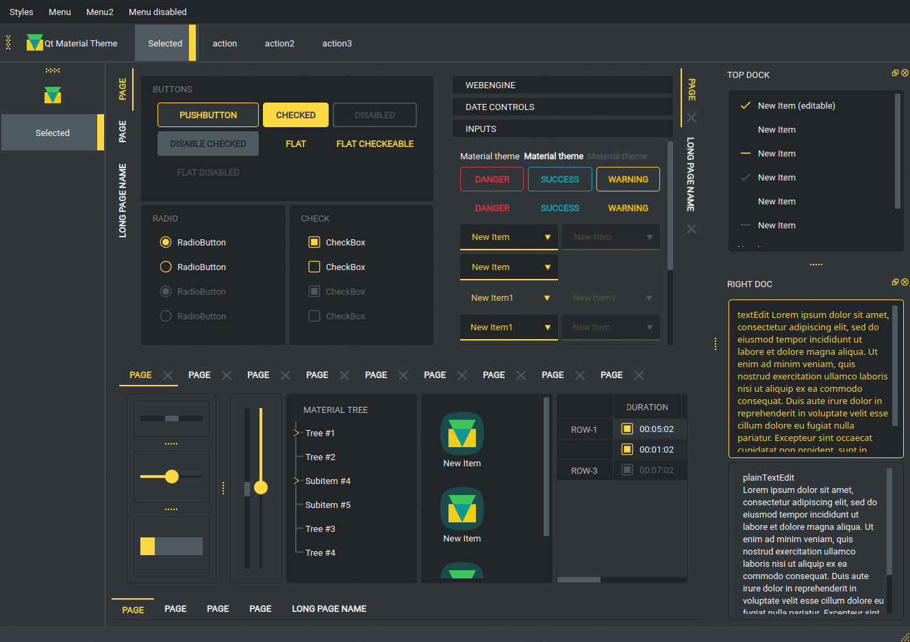

# Qt-Advanced-Stylesheets

[](gnu-lgpl-v2.1.md)

Advanced Stylesheets with Theming Support for Qt. The library allows you to
create stylesheets that contain variables that are replaced at runtime like in
this example:

```css
QComboBox:disabled {
  color: {{primaryColor|opacity(0.2)}};
  background-color: {{secondaryColor|opacity(0.75)}};
  border-bottom: 2px solid {{primaryColor|opacity(0.2)}};
}

QComboBox::drop-down {
  border: none;
  color: {{primaryColor}};
  width: 20px;
}
```

This allows runtime color switching for stylesheet themes. The libray also
adjusts the colors of the *.svg resources at runtime.
If you run the `full_features` example, then you can test the functionality.

There are some custom dark themes:



And light:


## Navigation

- [Navigation](#navigation)
- [Build](#build)
- [Getting started](#getting-started)
- [Run examples](#run-examples)
- [Future Plans](#future-plans)
- [License information](#license-information)
- [Credits](#credits)
- [Donation](#donation)

## Build

Open the `acss.pro` file with QtCreator and start the build, that's it.
You can run the example projects and test it yourself.

## Getting started

Have look into the file `CMainWindow` in the full_features example to learn
ho to use the `CStyleManager`. Here are the basic steps to add the style
manager to your application:

```cpp
QString AppDir = qApp->applicationDirPath();
CStyleManager StyleManager;

// first set the directory that contains all your styles
StyleManager.setStylesDirPath(AppDir + "/../../styles");

// now set the output folder where the processed styles are stored. The
// style manager will create a sub directory for each style
StyleManager.setOutputDirPath(AppDir + "/output");

// set the current style and select a theme. After these two calls, the output
// folder will contains the generated resoruces and stylesheet.
StyleManager.setCurrentStyle("qt_material");
StyleManager.setCurrentTheme("dark_teal");

// now you can set the generated stylesheet
qApp->setStyleSheet(StyleManager.styleSheet());
```

## Run examples

The `full_features` example shows a window with almost all widgets to test all 
themes and create new ones.


## Future Plans

The idea is to merge my [QtFluentDesign](https://github.com/githubuser0xFFFF/QtFluentDesign) project into this project to create a nice Windows 11 style that can dynamically
adapt to the Windows accent color and to the Window dark and light theme.


## License information

[](gnu-lgpl-v2.1.md)
This project uses the [LGPLv2.1 license](gnu-lgpl-v2.1.md) for the source code.
The stylesheets use individal licenses which are located in the directory of
the corresponding style.

## Credits

- Uwe Kindler, Project Maintainer
- [GCPDS](https://github.com/UN-GCPDS) - Grupo de control y procesamiento digital de señales

The project is strongy inspired by the great [Qt-material](https://github.com/UN-GCPDS/qt-material) project from [GCPDS](https://github.com/UN-GCPDS) and uses the qt-material stylesheet from this project.

## Donation

If this project help you reduce time to develop or if you just like it, you can give me a cup of coffee :coffee::wink:.

<a href="https://www.paypal.com/cgi-bin/webscr?cmd=_s-xclick&hosted_button_id=85R64TMMSY9T6">
  
</a>